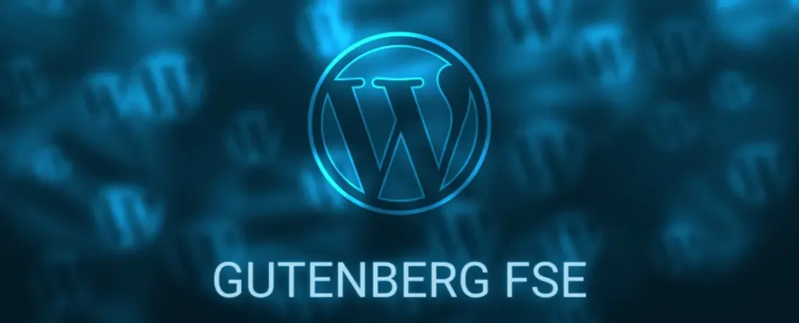

# defi_whodUnit_FSE

Intégration HTML/CSS ou SCSS + JS (pas de PHP) à réaliser dans un thème FSE

Lien de la vidéo sur wetransfer: [https://we.tl/t-PzL0ZGeawX](https://we.tl/t-PzL0ZGeawX)

**Objectifs :** Réaliser la frontPage d’un thème FSE (approche mobil-first), en respectant les bonnes pratiques au maximum.

Eviter au maximum les extensions, l’objectif est d’être sur du natif dnas la mesure du possible et dans l’idéal, les extensions utilisées devrait-être réalisées par “Automatic”.

Il serait intéressant de voir les points compliqués à réaliser en natif et comment corriger le problème (soit extension, ou surcouche de code)

Sans être dans l'excès, il est intéressant de voir la propreté du code et avoir une idée du temps passé.

Globalement, rien de particulier, juste des choses simples que l'ont réalise quotidiennement mais qui selon moi, ne sont pas très simple avec le FSE, même s'il n'y a pas débat, c'est un très bon outil et c'est l'avenir de WordPress

J’espère que tu relèvera ce défi et que tu y prendra du plaisir 😉.

  
**Charte graphique et typographique:
  

**font-family h1:** TrushmeScript

**font-family:** “arial - sans-serif “ / ou au choix

  

**code couleur hexa:**

  

**background(identique à toutes les pages) :**  linear-gradient(216deg, rgba(77, 77, 77,0.05) 0%, rgba(77, 77, 77,0.05) 25%,rgba(42, 42, 42,0.05) 25%, rgba(42, 42, 42,0.05) 38%,rgba(223, 223, 223,0.05) 38%, rgba(223, 223, 223,0.05) 75%,rgba(36, 36, 36,0.05) 75%, rgba(36, 36, 36,0.05) 100%),linear-gradient(44deg, rgba(128, 128, 128,0.05) 0%, rgba(128, 128, 128,0.05) 34%,rgba(212, 212, 212,0.05) 34%, rgba(212, 212, 212,0.05) 57%,rgba(25, 25, 25,0.05) 57%, rgba(25, 25, 25,0.05) 89%,rgba(135, 135, 135,0.05) 89%, rgba(135, 135, 135,0.05) 100%),linear-gradient(241deg, rgba(55, 55, 55,0.05) 0%, rgba(55, 55, 55,0.05) 14%,rgba(209, 209, 209,0.05) 14%, rgba(209, 209, 209,0.05) 60%,rgba(245, 245, 245,0.05) 60%, rgba(245, 245, 245,0.05) 69%,rgba(164, 164, 164,0.05) 69%, rgba(164, 164, 164,0.05) 100%),linear-gradient(249deg, rgba(248, 248, 248,0.05) 0%, rgba(248, 248, 248,0.05) 32%,rgba(148, 148, 148,0.05) 32%, rgba(148, 148, 148,0.05) 35%,rgba(202, 202, 202,0.05) 35%, rgba(202, 202, 202,0.05) 51%,rgba(181, 181, 181,0.05) 51%, rgba(181, 181, 181,0.05) 100%),linear-gradient(92deg, hsl(214,0%,11%),hsl(214,0%,11%));

  
**green :** #087C35

**yellow:** #F3E600

**blue :** #24388D

**white :** #FFFFFF

**Black :** #000000

  

**Logo :**

Pour le logo n'importe quelle image dans l'esprit de la danse PNG ou WebP fera l'affaire
Desktop width: 9rem
tablet : 7rem 
mobil : 4.5rem

**Images : **
Comme pour le logo, des images en lien avec la danse feront l'affaire pour ce défi.

**Body:** Linear-gradient précisé dans la charte ci-dessus. Pas de complication a le mettre en place en CSS mais il serait intéressant qu’il soit géré par le theme.json.

Un loader au couleur du Gabon au chargement de la page. 

**Header :**

**Desktop:** Logo a gauche |  Navigation au centre  | Icones réseaux sociaux (Facebook et Instagram

**Tablet & mobil :** Logo à gauche | Icones réseaux sociaux (Facebook et Instagram | menu burger

  
Les traits du burger doivent-être aux couleurs du Gabon (vert, jaune et bleu)

Le menu doit s’ouvrir de gauche a droite avec une transition et avoir le linear-gradient comme couleur de fond.

Le logo vient de la gauche vers la droite, la partie centrale du haut vers le bas, la partie de droite vient de la droite vers la gauche (une animation est nécessaire sur les éléments mais elle est libre)

**Main :**

Un loader au couleur du Gabon au chargement

**H1**Desktop: 5.2rem, tablet : 4.8rem, mobil : 3rem: L’art de la danse

**H2**Desktop: 5.2rem, tablet : 2.2rem, mobil : 1.4rem: Cours de danses Latines & Afro

**P**Desktop: 1.4rem, tablet : 1.2rem mobil : 1.2rem : lorem ipsum
  

Image de fond doit se composer une fois le loader parti. L’image doit être responsive et les vignettes doivent-être placées correctement (pas d’emplacement précis mais l’emplacement doit être cohérent. Le nombre d’images de fond et de minimum 1 mais ont peut imaginer que toutes les 5s, une nouvelle image se recompose et s’affiche a la place de la précédente (bonus)

  

La séparation avec la section suivante est libre.

  

L’image suivante doit avoir un paralax

Les textes arrivent au scroll alternativement de gauche et de droites

**Footer (optionnel):**

Liberté totale si envie de le réaliser
